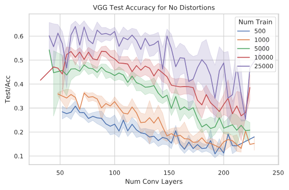
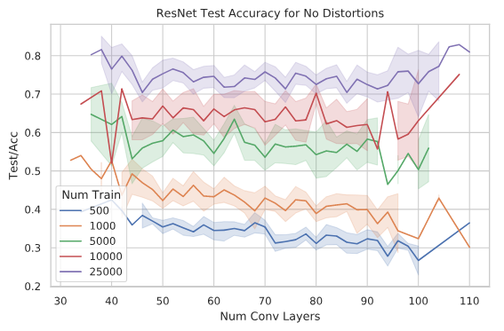
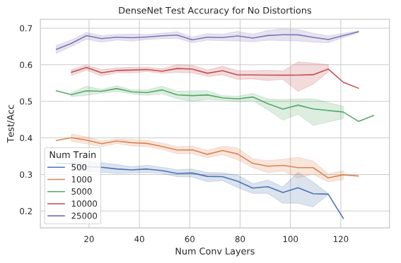

# Random NAS

This code was used to explore the fundamental differences between the DNN
architecture types VGG, ResNet, and DenseNet.

Random NAS is used to create random structures of the three DNN types and then
test them for their performance. Specifically, we look at the performance when
trained on small training datasets and the networks robustness against distortions.

## Running the Code

To be able to run the code using the two methods stated below, you have to create
the folders `log` and `save_dir` in the current directory.

### Locally

The experiment's main function is contained in `exp_main.py`. However, we
suggest to run the code through the `yagi_rnd_nas_cli.py` file if your machine
has multiple GPUs to take advantage of them. For example, to run a DenseNet
experiment on multiple GPUs, you can use:

```bash
python3 yagi_rnd_nas_cli.py --run_type local --num_train 50000 --archs_per_task 38 --arch_type densenet --num_min_depth 2 --num_max_depth 7
```

That would start the experiment with the DenseNet architecture on your local computer.
It would use all available GPUs and try 38 different architectures per GPU.
All architectures would have between 2 and 7 layers (inclusive) and are trained
on 50k training images of CIFAR10.

### On a Server (qsub)

```bash
python3 yagi_rnd_nas_cli.py --run_type qsub --num_train 25000 --archs_per_task 20 --arch_type resnet --server_names yagi11 yagi12 yagi13 --file_to_run yagi_rnd_nas_resnet_archs.sh
```

Basically almost identical to the `local` command. When selecting `--run_type qsub`,
training will be started on all machines provided in the `--server_names` list.
**Important:** for this to work the provided server names must be in your host file
and you must have a valid SSH key without password promt for the servers
(either unencrypted or provided via ssh_agent etc).
In this case, the script checks for the number of available GPUs on each server
and then executes `--archs_per_task` number of trail runs on each available GPU.

## Interpreting Results

The log files are stored in `./log/*` but don't contain any information used for
evaluation, rather they are just for debugging/verification/process monitoring.

The results are stored in `./save_dir/*`, with one folder for each process,
i.e. each GPU. `accuracies.json` contains all recorded accuracies for all runs per
process. `config.json` contains the configuration used for that run.
`log-active.txt` contains the layer structure used and the number of total layers
per layer structure. The number of layers is incorrect in `config.json`.


### Consolidating Results

To consolidate the results of one type of run when wanting to plot a graph for
all ResNet runs for example, there is a script in `create_consolidated_results_json.py`.
To get a consolidated results file for all ResNet runs for example, run:

```bash
$ python3 create_consolidated_results_json.py --arch_type resnet
Saved the consolidated results json to vgg.json
```

### Plotting Results

To plot the results contained in the consolidated results file, the scripts in
`graph_from_csv.py` can be used. The file is designed to be run as jupyter notebook.
However, it was only tested as being run as a notebook within VSCode with the
MS Python extension.  
In the file, first various functions are defined which can then be run as desired.

#### Graph Types

##### Absolute Distortion Accuracy

To plot the absolute accuracy values for the individual network architecture
types, use the `analyse_arch_dict()` function. The result is a graph with
accuracy on the `y` axis and the number of convolutional layers on the `x` axis.
The distortion can be defined with the `dist=` flag, where `normal` is the
default.

##### Distortion Accuracy Relative to Clean Dataset

To get a graph where `normal` or no disortion always is at `1.0` and all other
values are relative to it, use the `compare_dists()` function with the
`relative=True` flag.

##### Visualisation of Feature Map Ranks

To look at the eigenvalues of the feature maps of the networks to determine the
information content retained in the individual model types, use the functions
in `look_at_feature_maps.py`. More details to follow...


## Results

In the default settings we trained the the networks for 100 epochs and randomly
sampled ~300 different architectures for each network type (VGG, ResNet,
DenseNet). The networks were trained with 500, 1000, 5000, 10k, 25k, and 50k
training images from CIFAR10.




